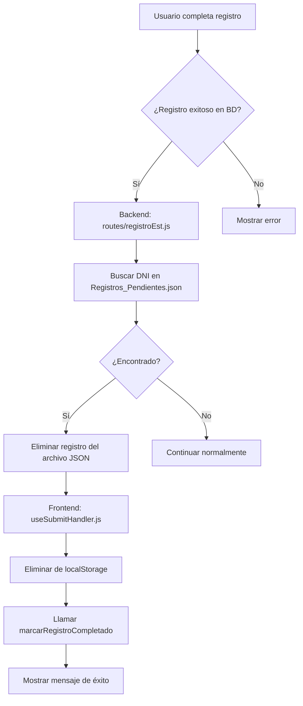

# Eliminación Automática de Registros Pendientes

## Descripción del Problema Resuelto

Anteriormente, cuando un estudiante completaba su registro (se guardaba en la base de datos), el registro permanecía en el archivo `Registros_Pendientes.json`, causando duplicados y confusión en el sistema.

## Solución Implementada

Se ha implementado un sistema de eliminación automática que funciona en múltiples puntos del flujo:

### 1. Backend - Eliminación Automática

#### En `routes/registroEst.js` - Endpoint `/registrar`

- **Cuándo**: Al completar un registro de estudiante exitosamente
- **Qué hace**: Busca y elimina automáticamente cualquier registro pendiente con el mismo DNI
- **Archivo modificado**: `d:\CEIJA5Edu\proyectoCEIJA5\routes\registroEst.js` (líneas ~248-268)

```javascript
// Eliminar registro pendiente si existe
try {
  const registrosPendientesPath = path.join(
    __dirname,
    "../data/Registros_Pendientes.json"
  );
  // Leer, filtrar y actualizar archivo
  const registrosFiltrados = registrosPendientes.filter(
    (registro) => registro.dni !== dni
  );
  if (registrosFiltrados.length < registrosPendientes.length) {
    await fs.writeFile(
      registrosPendientesPath,
      JSON.stringify(registrosFiltrados, null, 2)
    );
    console.log(
      `🗑️ Registro pendiente eliminado automáticamente para DNI: ${dni}`
    );
  }
} catch (cleanupError) {
  // No interrumpir el flujo principal
}
```

#### En `routes/registrosWeb.js` - Endpoint `/procesar`

- **Cuándo**: Al procesar un registro web en la base de datos
- **Qué hace**: Elimina automáticamente el registro pendiente correspondiente
- **Archivo modificado**: `d:\CEIJA5Edu\proyectoCEIJA5\routes\registrosWeb.js` (líneas ~380-400)

#### En `routes/notificaciones_new.js` - Endpoint `/marcar-completado`

- **Cuándo**: Cuando el frontend notifica que un registro se completó
- **Qué hace**: Elimina el registro del archivo JSON
- **Endpoint**: `POST /api/notificaciones/marcar-completado`

### 2. Frontend - Notificación de Completación

#### En `services/serviceRegInscripcion.jsx`

- **Nueva función**: `marcarRegistroCompletado(dni)`
- **Propósito**: Notificar al backend cuando un registro se completa desde el frontend

#### En `hooks/useSubmitHandler.js`

- **Cuándo**: Al completar exitosamente un registro pendiente
- **Qué hace**:
  1. Elimina del localStorage (funcionalidad existente)
  2. Llama al backend para eliminar del archivo JSON (nueva funcionalidad)

```javascript
// Si se completó un registro pendiente, eliminar de localStorage y del backend
if (esRegistroPendienteCompletado) {
  eliminarRegistroPendiente(values.dni);

  // También notificar al backend para eliminar del archivo JSON
  try {
    await serviceRegInscripcion.marcarRegistroCompletado(values.dni);
    console.log(
      `🎉 Registro pendiente eliminado del backend para DNI ${values.dni}`
    );
  } catch (error) {
    console.error("Error al eliminar registro pendiente del backend:", error);
    // No detener el flujo, el registro ya se completó exitosamente
  }

  mensajeExito += " ✅ Registro pendiente completado exitosamente.";
}
```

### 3. Componentes Afectados

#### `ModalRegistrosPendientes.jsx`

- **Función existente**: `eliminarRegistro()` - Elimina manualmente desde la interfaz
- **Comportamiento**: Sin cambios, sigue funcionando para eliminación manual

## Flujo Completo



## Archivos Modificados

### Backend

1. `routes/registroEst.js` - Eliminación automática en registro normal
2. `routes/registrosWeb.js` - Eliminación automática en registro web
3. `routes/notificaciones_new.js` - Endpoint para notificación desde frontend

### Frontend

1. `services/serviceRegInscripcion.jsx` - Servicio para notificar completación
2. `hooks/useSubmitHandler.js` - Lógica de notificación al backend

## Ventajas de la Solución

1. **Automática**: No requiere intervención manual
2. **Robusta**: Maneja errores sin interrumpir el flujo principal
3. **Consistente**: Funciona tanto para registros de admin como web
4. **Backward Compatible**: No afecta funcionalidad existente
5. **Fail-Safe**: Si falla la eliminación, no afecta el registro exitoso

## Casos de Uso Cubiertos

1. ✅ **Registro directo de admin**: Elimina pendiente automáticamente
2. ✅ **Completar registro pendiente desde modal**: Elimina tras completar
3. ✅ **Procesar registro web**: Elimina pendiente si existe
4. ✅ **Eliminación manual**: Sigue funcionando desde la interfaz

## Logging y Debugging

Todos los procesos incluyen logging detallado:

- `🗑️ Registro pendiente eliminado automáticamente para DNI: ${dni}`
- `🎉 Registro pendiente eliminado del backend para DNI ${dni}`
- Manejo de errores sin interrumpir el flujo principal

## Testing y Verificación

### ✅ Estado Actual: **PROBLEMA RESUELTO**

La eliminación de registros pendientes funciona correctamente tanto de forma automática como manual.

### Scripts de Prueba Incluidos

1. **`test-eliminacion-pendientes.js`** - Prueba backend directamente
2. **`debug-eliminacion.js`** - Debug con HTTP requests
3. **`frontend/test-frontend-service.js`** - Prueba servicio frontend

### Funcionalidades Verificadas ✅

1. **Eliminación Manual**: Botón "Eliminar" en el modal funciona correctamente
2. **Eliminación Automática**: Se ejecuta al completar registro en BD
3. **Backend**: Endpoints funcionan correctamente
4. **Frontend**: Servicios y componentes actualizan el estado correctamente

### Uso Normal del Sistema

1. **Para eliminar manualmente**:
   - Abrir "Registros Pendientes"
   - Hacer clic en "Eliminar" en cualquier registro
   - Confirmar en el diálogo
   - El registro se elimina automáticamente de la interfaz

2. **Eliminación automática**:
   - Ocurre automáticamente al completar cualquier registro
   - No requiere intervención manual
   - Se registra en los logs del servidor
